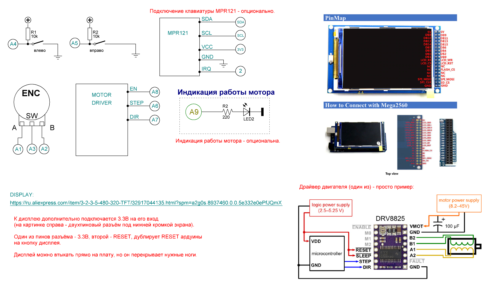

# Делительная головка на Arduino Mega и 480x320 TFT

* Все настройки прошивки - в файле <b>CONFIG.h</b>;
* Схема соединений - в папке <b>Schematic</b> (проект для программы sPlan);
* Arduino Mega 2560;
* Дисплей - вот такой, на 3.2'', 480х320 на контроллере ILI9481: https://bit.ly/2X7UXAe;
* Клавиатура - MPR121, ёмкостная, на шину I2C (использовать не обязательно): https://bit.ly/2BDvSnO;
* Энкодер - вот такой (да любой можно использовать, главное, чтобы подтяжка его выводов была к питанию): https://bit.ly/2EhlMus;
* Кнопки - любые по вкусу;
* Шаговый и его драйвер - любой по вкусу;
* Индикация работы шагового - светодиод и резистор, использовать индикацию - опционально.

## Библиотека UTFT и китайские дисплеи

<b>ВНИМАНИЕ!</b> В архиве с проектом, в папке <b>Libraries</b> - выложены две версии библиотеки UTFT. Китайцы иногда оставляют старую шелкографию, на которой написано ILI9481, а по факту контроллер дисплея - устанавливают HX8357C. Поэтому, как устанавливать: сперва поставьте библиотеку UTFT из архива UTFT.zip, настройте драйвер вашего дисплея а настройках прошивки, закачайте её, и убедитесь, что всё норм. Если изображение зеркалит - ставим библиотеку UTFT из архива UTFT-ALT.zip, указываем в настройках прошивки тип контроллера как TFT32MEGA_2, перезакачиваем прошивку.

В любом случае - если на дисплее информация отображается не так, то: идёте в файл UTFT.h библиотеки, и в самом верху там перечислены все контроллеры, которые поддерживает библиотека. Последовательно (с пониманием того, что делаете, конечно), подставляете тип контроллера в настройку TFT_MODEL прошивки (файл CONFIG.h, строка 44), перезакачиваете, смотрите, что выходит.

Если ничего не получается - всегда можно найти версию библиотеки UTFT, поддерживающую контроллер вашего дисплея. Но! Библиотеки, выложенные с проектом - немного подправлены, в них в файле UTFT.cpp добавлены вызовы yield(), чтобы при долгой отрисовке не тормозил опрос кнопок и энкодера. Поэтому в том случае, если вы используете стороннюю библиотеку, помните - вы делаете это на свой страх и риск!

Те дисплеи, которые покупал я, и для которых была писана прошивка - имеют и шелкографию ILI9481, и такой же контроллер дисплея. Но китайцы - стали мудрить, поэтому настройка прошивки - дело вдумчивое. Повторюсь: прошивку можно настроить под любой тип контроллера, поддерживаемый библиотекой UTFT. Из коробки прошивка настроена на контроллер ILI9481 и дисплей 3.2 дюйма с разрешением 480х320, легко перестраивается на дисплей с контроллером ILI9486 размером 3.5 дюйма с таким же разрешением, как показывает опыт пользователей - также можно перестроить на дисплей 3.5 дюйма на контроллере HX8357C, с разрешением 480х320.

Дерзайте, и у вас всё получится!

## Принцип управления

* Перемещения по экранным кнопкам - происходят при помощи вращения энкодера;
* Клик по экранной кнопке - происходит при помощи нажатия кнопки энкодера;
* Уменьшение/увеличение значения параметра на экране - при помощи вращения энкодера, или набора на клавиатуре;
* Если на экране только одно редактируемое значение - то его изменение осуществляется при помощи вращения энкодера, или вводом с клавиатуры. Кнопка "< НАЗАД" на таком экране - всегда подсвечена, и переход на предыдущий экран осуществляется кликом кнопки энкодера;
* Если на экране есть несколько редактируемых полей, то активное редактируемое поле - подсвечивается, и ввод доступен именно в него. Для смены фокуса ввода - клик кнопкой энкодера. В описываемом случае кнопка "< НАЗАД" на экране - также служит полем ввода, и клик на ней осуществляется не по клику на энкодере - а вращением энкодера в любую сторону.

## Схема соединений

